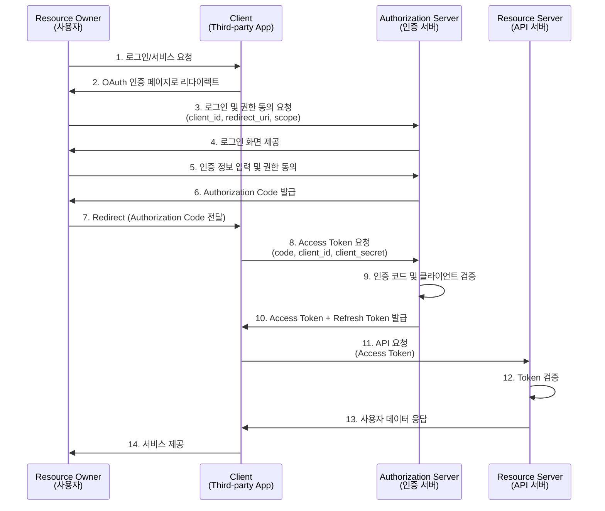
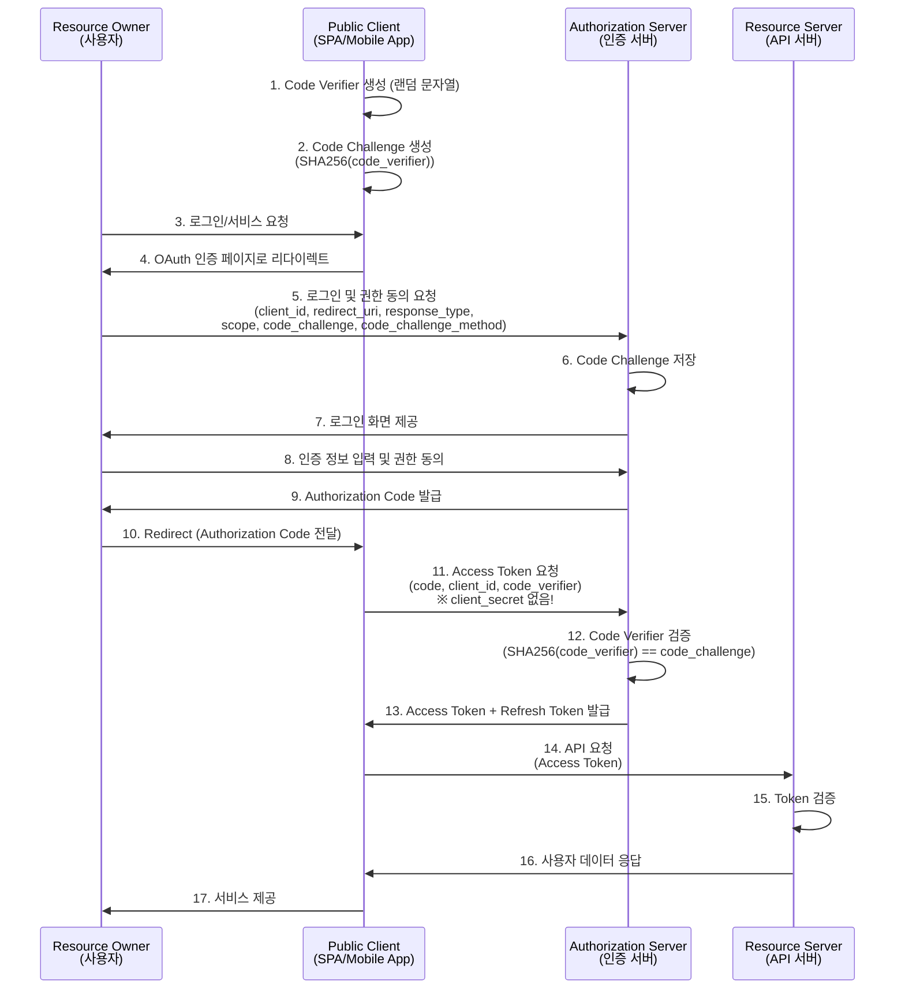

# OAuth2 role
- Resource Owner : 사용자 (자신의 정보에 접근 권한을 가진 자) = End-User
- Client : 외부 앱 (사용자의 정보를 요청하는 앱) = Third-party app / Third-party app의 Client
- **Authorization Server** : 인증 및 권한 부여를 처리하는 서버 (서비스)
- **Resource Server** : 실제 사용자의 데이터를 제공하는 서버 (API 서버) = HTTP Service

# OAuth2 Client type
- Confidential Client
    - Backend service
    - Authorization Code Flow 
- Public Client
    - Browser(SPA), Mobile app, Desktop app
    - Authorization Code Flow + PKCE

## Authorization Code Flow
## Implicit Flow / PKCE(Proof Key for Code Exchange)
## Client Credential Flow

# Endpoint (RFC 6749, RFC 7662)
- /authorize : 사용자 인증 및 동의 처리
- /token : 인증 코드 -> Access Token 교환
- /userinfo : 사용자 정보 제공
- /revoke : 토큰 폐기
- /introspect : 토큰 유효성 검사

## Access Token
- access_token
- expires_in
- id_token : 사용자의 ID 정보가 포함된 JWT
- scope
- token_type : Bearer
- refresh_token

## Refresh Token
## JWT 사용 여부
## 토근 저장소
- Redis
## 토큰 만료 및 폐기 정책

# 사용자 동의 및 범위(Scope) 관리

# 클라이언트 등록 및 관리
- 클라이언트 앱 등록 : client_id, client_secret 발급
- redirection URI 검증
- 권한 부여 범위 설정

# 방식
- **사용자를 대신해 인증 상호작용 조정**
- Client app 자체가 직접 권한을 얻음

# OAuth2 Authorization Code Flow Sequence
- [웹 서버 애플리케션용 OAuth 2.0 사용](https://developers.google.com/identity/protocols/oauth2/web-server?hl=ko)

## Confidential Client (백엔드 서버)
- `client_secret`을 안전하게 보관 가능
- Authorization Code Flow 사용
- 예: 전통적인 웹 애플리케이션의 백엔드

---

# OAuth2 Authorization Code Flow + PKCE Sequence (Public Client)
- [클라이언트 측 웹 애플리케이션용 OAuth 2.0](https://developers.google.com/identity/protocols/oauth2/javascript-implicit-flow?hl=ko)

## Public Client (SPA/모바일 앱)
- `client_secret`을 안전하게 보관 불가능 (코드 노출됨)
- **PKCE(Proof Key for Code Exchange)** 사용 필수
- Code Verifier와 Code Challenge로 보안 강화
- 예: React/Vue SPA, React Native 앱, Flutter 앱

### PKCE 핵심 포인트:
1. **Code Verifier**: 클라이언트가 생성한 랜덤 문자열 (43~128자)
2. **Code Challenge**: Code Verifier를 SHA256 해싱한 값
3. Authorization 요청 시 Challenge 전송, Token 요청 시 Verifier 전송
4. 서버가 Verifier를 해싱하여 Challenge와 일치하는지 검증
5. 중간자 공격 방지 (Authorization Code 탈취해도 Verifier 없으면 Token 발급 불가)

